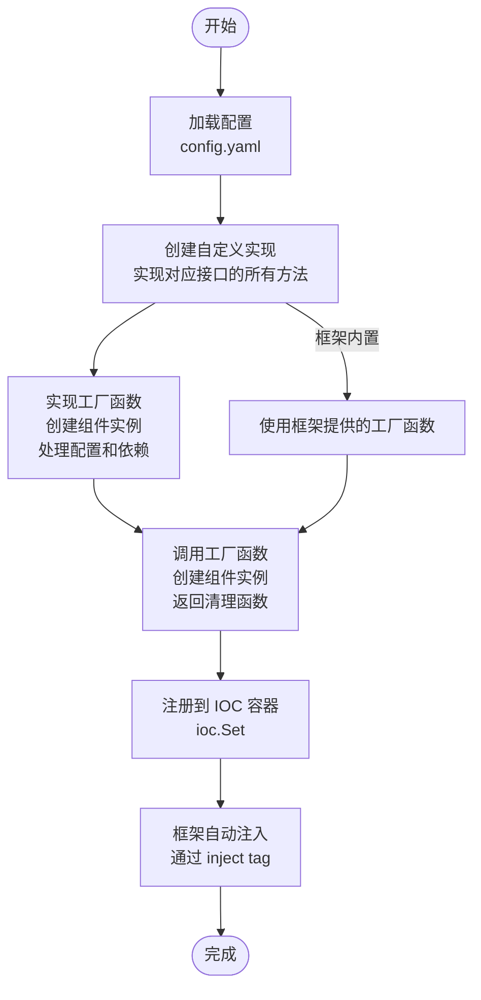

# 组件替换说明

## 概述

Hecc-Blot 框架采用**面向接口编程**的设计理念，所有组件都通过接口契约进行交互。这种设计使得各个组件可以方便地进行替换，而不影响整体架构。

## 替换原则

### 1. 遵循接口契约

替换组件时，必须实现对应的接口：

```go
// 假设要替换日志组件
type MyCustomLog struct{}

// 必须实现 ILog 接口的所有方法
func (m MyCustomLog) Debug(ctx context.Context, msg string, fields ...interface{}) {
    // 自定义实现
}

func (m MyCustomLog) Error(ctx context.Context, msg string, fields ...interface{}) {
    // 自定义实现
}

func (m MyCustomLog) Info(ctx context.Context, msg string, fields ...interface{}) {
    // 自定义实现
}

func (m MyCustomLog) Warn(ctx context.Context, msg string, fields ...interface{}) {
    // 自定义实现
}
```

### 2. 注册到IOC容器

实现接口后，通过 IOC 容器注册即可替换默认实现：

```go
// 创建自定义实现
myLog := &MyCustomLog{}

// 注册到IOC容器，覆盖默认实现
container := ioc.New()
container.Set(new(iCoreLog.ILog), myLog)
```

---

## 各组件替换示例

### 1. 替换日志组件

**需求**: 将默认的 zap 日志替换为 logrus

**步骤**:

```go
// 1. 创建自定义日志服务，实现 ILog 接口
type LogrusLogSvc struct {
    logger *logrus.Logger
}

func NewLogrusLogSvc() iCoreLog.ILog {
    logger := logrus.New()
    logger.SetFormatter(&logrus.JSONFormatter{})
    logger.SetLevel(logrus.InfoLevel)
    return &LogrusLogSvc{logger: logger}
}

func (l LogrusLogSvc) Debug(ctx context.Context, msg string, fields ...interface{}) {
    l.logger.Debug(msg, fields...)
}

func (l LogrusLogSvc) Error(ctx context.Context, msg string, fields ...interface{}) {
    l.logger.Error(msg, fields...)
}

func (l LogrusLogSvc) Info(ctx context.Context, msg string, fields ...interface{}) {
    l.logger.Info(msg, fields...)
}

func (l LogrusLogSvc) Warn(ctx context.Context, msg string, fields ...interface{}) {
    l.logger.Warn(msg, fields...)
}

// 2. 在 main 函数中注册
func main() {
    // 使用自定义日志服务
    logSvc := NewLogrusLogSvc()
    
    // 注册到IOC容器
    container := ioc.New()
    container.Set(new(iCoreLog.ILog), logSvc)
    
    // ... 其他初始化代码
}
```

### 2. 替换数据库组件

#### 2.1 使用框架内置数据库

框架使用Gorm作为内置ORM库，支持 MySQL 和 PostgreSQL：

```go
// 1. 在配置文件中添加数据库配置
// config.yaml
db:
  mysql:
    ip: "127.0.0.1"
    port: 3306
    username: "root"
    password: "123456"
    db_name: "core_db"
  postgres:
    ip: "127.0.0.1"
    port: 5432
    username: "postgres"
    password: "123456"
    db_name: "core_db"

// 2. 框架自动初始化所有配置的数据库
dbFactory, clearUp, err := db.NewDbFactory(&config.Db, logSvc)
defer clearUp()

// 3. 设置默认数据库
// 此步骤不是必须，不设置默认使用mysql
dbFactory.SetDefault(dbEnum.Postgres)

// 4. 在 API 中使用
func (a AddApi) Call(ctx *gin.Context) (interface{}, iCoreError.IError) {
    err := a.DbFactory.Build(ctx).Add(&newAccount)
    return newAccount, nil
}
```

#### 2.2 使用其他 ORM 框架（如 Xorm）

**需求**: 使用 Xorm 替代 GORM  
可以参考以下示例，省略具体实现
```go
// 1. 创建基于 Xorm 的数据库服务，实现 IDb 接口
import "xorm.io/xorm"

type XormDbSvc struct {
    BaseDbSvc
    engine *xorm.Engine
}

func newXormDbSvc(config *dbConf.MysqlConfig, logger log.ILog) (db.IDb, func(), error) {
    ....

    return &XormDbSvc{engine: engine}, func() { engine.Close() }, nil
}

// 实现 IDb 接口方法
func (x *XormDbSvc) Add(entry db.IDbModel) error {
    // 使用 x.engine 执行插入操作
    return err
}

func (x *XormDbSvc) Remove(entry db.IDbModel) error {
    // 使用 x.engine 执行删除操作
    return err
}

func (x *XormDbSvc) Query(entry db.IDbModel) db.IDb {
    // 使用 x.engine 构建查询链
    return x
}

func (x *XormDbSvc) Take(dst interface{}) error {
    // 使用 x.engine 执行单条查询
    return err
}

func (x *XormDbSvc) Find(dst interface{}) error {
    // 使用 x.engine 执行多条查询
    return err
}

// 2. 在 main 函数中注册
func main() {
    xormDb, cleanup, err := newXormDbSvc(&config.Db.Mysql, logSvc)
    if err != nil {
        panic(err)
    }
    defer cleanup()

    dbFactory := &XormDbFactory{db: xormDb}
    container := ioc.New()
    container.Set(new(iCoreDb.IDbFactory), dbFactory)
}
```

#### 2.3 扩展框架内置数据库（推荐）

如果需要在框架内置 GORM 实现基础上添加新数据库类型，可以扩展 Factory：

```go
// 1. 创建自定义数据库服务
type CustomDbSvc struct {
    BaseDbSvc
}

func newCustomDbSvc(config *CustomConfig, logger log.ILog) (db.IDb, func(), error) {
    // 自定义初始化逻辑
    return &CustomDbSvc{}, func() {}, nil
}

// 2. 扩展 Factory
type CustomDbFactory struct {
    *db.Factory
}

func NewCustomDbFactory(config *dbConf.Config, logger log.ILog) (db.IDbFactory, func(), error) {
    factory, cleanup, err := db.NewDbFactory(config, logger)
    if err != nil {
        return nil, cleanup, err
    }
    return &CustomDbFactory{Factory: factory.(*db.Factory)}, cleanup, nil
}

// 3. 注册自定义数据库类型
func (f *CustomDbFactory) Build(ctx context.Context, v ...dbEnum.Value) db.IDb {
    // 处理自定义类型
    return f.Factory.Build(ctx, v...)
}
```

### 3. 替换缓存组件

**需求**: 将默认缓存替换为自定义缓存实现

**步骤**:

```go
// 1. 创建自定义缓存服务
type MyCacheSvc struct{}

func (m MyCacheSvc) Set(key string, value interface{}, expiration time.Duration) error {
    // 自定义缓存逻辑
    return nil
}

func (m MyCacheSvc) Get(key string) (interface{}, error) {
    // 自定义缓存逻辑
    return nil, nil
}

// ... 其他方法

// 2. 自定义 Factory
type MyCacheFactory struct{}

func (f MyCacheFactory) Local() iCoreCache.ILocalCache {
    return &MyCacheSvc{}
}

func (f MyCacheFactory) Redis() iCoreCache.IRedisCache {
    return &MyRedisSvc{}
}

// 3. 在 main 函数中注册
func main() {
    cacheFactory := &MyCacheFactory{}
    container := ioc.New()
    container.Set(new(iCoreCache.ICacheFactory), cacheFactory)
}
```

---

## 替换注意事项

### 1. 接口兼容性

- 必须实现接口的**所有方法**
- 方法签名必须完全匹配
- 返回值类型必须一致

### 2. 生命周期管理

- 如果组件需要资源清理（如数据库连接），应返回清理函数
- 在 main 函数中使用 `defer` 确保资源被正确释放

### 3. 配置兼容性

- 如果自定义组件需要新的配置字段，需要更新 `hecc-blot-core/entity/config` 目录下的配置结构体
- 配置文件格式保持 YAML 格式

### 4. 测试验证

替换组件后，应编写相应的单元测试：

```go
func TestMyCustomLog(t *testing.T) {
    logSvc := NewLogrusLogSvc()
    
    // 验证接口实现
    var _ iCoreLog.ILog = logSvc
    
    // 测试功能
    logSvc.Info(context.Background(), "test message")
}
```

---

## 替换流程图



---

## 总结

框架的面向接口设计使得组件替换非常简单：

1. **实现接口** - 创建自定义实现类，实现对应接口的所有方法
2. **注册到IOC** - 通过 `container.Set()` 将实例注册到容器
3. **自动生效** - 框架会自动注入新的实现，无需修改其他代码

这种设计实现了**依赖倒置原则**，高层模块不依赖低层模块的具体实现，只依赖抽象接口。

## 相关文档

| 文档 | 说明 |
|------|------|
| [IOC 注入](ioc_injection.md) | Set/SetWithName 注册原理 |
| [数据库组件](database.md) | IDbFactory/IDb 接口定义 |
| [缓存组件](cache.md) | ICacheFactory 接口定义 |
| [日志组件](logging.md) | ILog 接口定义 |
