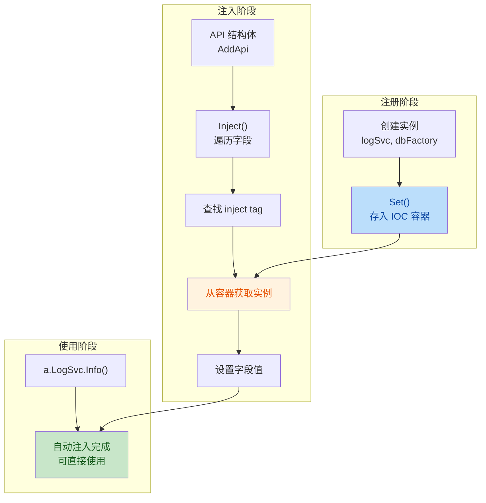

# IOC 组件自动注入说明

## 概述

IOC（控制反转）是 Hecc-Blot 框架的核心组件，负责管理所有服务的生命周期和依赖注入。通过 IOC 容器，框架可以自动将依赖注入到需要的地方，无需手动创建和传递依赖。

**IOC 工作流程**:



***

## 并发约定（最高级约定）

> ⚠️ **最高级约定**：本约定是整个 IOC 容器使用中优先级最高的约束，其他任何规则均不得与之冲突，违反本约定会导致数据竞争。

`Container` 内部 `values` map **不加锁**，依赖以下约定保证并发安全：

- **`Set` / `SetWithName` 仅允许在启动初始化阶段调用**（单线程，先注册后启动）；
- 初始化完成后容器进入**只读**，此时 `Get` / `Inject` 可安全并发调用；
- **运行时禁止再 `Set`**，否则会导致数据竞争。

```go
container := ioc.New()

// 初始化阶段：集中注册，此时尚未启动服务
container.Set(new(iCoreLog.ILog), logSvc)
container.Set(new(iCoreDb.IDbFactory), dbFactory)

// 运行阶段：只读并发调用 Get / Inject，不再 Set
apiHandle.Listen()
```

***

## IOC 核心实现

### 1. 核心数据结构

```go
// Container 依赖注入容器，可实例化，支持多容器隔离
type Container struct {
    values map[reflect.Type]map[string]reflect.Value
}

// New 创建新的注入容器
func New() *Container
```

- **外层 Map**: Key 为接口类型 (`reflect.Type`)，Value 为内层 Map
- **内层 Map**: Key 为实例名称（用于区分同接口的多个实现），Value 为实例的反射值
- **容器实例**: 通过 `ioc.New()` 显式创建，框架组件依赖 `IContainer` 接口（见 `framework/contract/ioc`）而非具体实现

### 2. 注册方法

#### Set - 注册默认实例

```go
func (c *Container) Set(interfaceObj interface{}, instance interface{}) {
    c.SetWithName(interfaceObj, "", instance)
}
```

**参数说明**:

- `interfaceObj`: 接口类型（通常使用 `new(InterfaceType)` 获取）
- `instance`: 实现该接口的具体实例

**使用示例**:

```go
// 创建 IOC 容器
container := ioc.New()

// 注册日志服务
logSvc := log.NewLogger(&config.Log)
container.Set(new(iCoreLog.ILog), logSvc)

// 注册数据库工厂
dbFactory, _, _ := db.NewDbFactory(&config.Db, logSvc)
container.Set(new(iCoreDb.IDbFactory), dbFactory)
```

#### SetWithName - 注册命名实例

```go
func (c *Container) SetWithName(interfaceObj interface{}, name string, instance interface{})
```

**使用场景**: 同一接口有多个实现时，通过名称区分

```go
// 注册两个不同的日志实现
container.SetWithName(new(iCoreLog.ILog), "local", localLog)
container.SetWithName(new(iCoreLog.ILog), "remote", remoteLog)
```

***

## 自动注入原理

### 1. 注入流程

```go
func (c *Container) Inject(instance interface{}) {
    instanceValue := reflect.ValueOf(instance)
    if instanceValue.Kind() != reflect.Ptr {
        panic("ioc: 注入实例必须是指针")
    }
    inject(instanceValue)
}
```

**注入步骤**:

1. **检查类型**: 确保传入的是指针类型
2. **获取元素**: 通过 `Elem()` 获取指针指向的实际值
3. **遍历字段**: 遍历结构体的所有字段
4. **查找 inject tag**: 检查字段是否有 `inject` 标签
5. **获取实例**: 根据字段类型和名称从容器中获取实例
6. **设置值**: 将实例赋值给字段

### 2. 核心注入逻辑

注入时框架遍历结构体字段，查找 `inject` tag，根据字段类型和名称从容器中获取对应实例并赋值。遇到没有 `inject` tag 的字段时停止注入（因此注入字段必须排在请求参数前面）。

***

## 使用方式

### 1. 在 API 中注入依赖

```go
type AddApi struct {
    // 通过 inject tag 标记需要注入的字段
    DbFactory iCoreDb.IDbFactory `inject:""`
    LogSvc    iCoreLog.ILog      `inject:""`
    
    // 请求参数（必须放在最后）
    AddRequest
}

func (a AddApi) Call(ctx *gin.Context) (interface{}, iCoreError.IError) {
    // 直接使用注入的服务
    a.LogSvc.Info(ctx, "add account")
    err := a.DbFactory.Build(ctx).Add(&account)
    return nil, nil
}
```

### 2. 在中间件中注入依赖

```go
type TokenMiddleware struct {
    ResponseSvc iCoreApi.IResponse `inject:""`
}

func (t TokenMiddleware) Middleware() interface{} {
    return func(c *gin.Context) {
        // 使用注入的响应服务
        t.ResponseSvc.Regular(c, nil, errorSvc.NewError(response.TokenInvalid, err))
        c.Abort()
    }
}
```

### 3. 使用命名注入

```go
type CustomApi struct {
    // 指定注入名为 "custom" 的日志实例
    LogSvc iCoreLog.ILog `inject:"custom"`
}
```

***

## 替换框架组件并保持自动注入

### 场景说明

当对框架默认组件不满意时，可以替换为自定义实现，同时保持自动注入功能。

### 替换步骤

#### 1. 实现接口

```go
// 自定义日志实现
type MyLogSvc struct{}

func (m MyLogSvc) Debug(ctx context.Context, msg string, fields ...interface{}) {
    // 自定义实现
}

func (m MyLogSvc) Error(ctx context.Context, msg string, fields ...interface{}) {
    // 自定义实现
}

func (m MyLogSvc) Info(ctx context.Context, msg string, fields ...interface{}) {
    // 自定义实现
}

func (m MyLogSvc) Warn(ctx context.Context, msg string, fields ...interface{}) {
    // 自定义实现
}
```

#### 2. 注册到 IOC 容器

```go
func main() {
    // 创建 IOC 容器
    container := ioc.New()
    
    // 创建自定义实例
    myLog := &MyLogSvc{}
    
    // 注册到 IOC 容器（覆盖默认实现）
    container.Set(new(iCoreLog.ILog), myLog)
    
    // 创建 API 处理器
    apiHandle := api.NewApiSvc(&config.Server, responseSvc, traceSvc, container)
    
    // 注册 API（自动注入时会使用自定义实现）
    apiHandle.Post("account/add", &AddApi{})
    
    apiHandle.Listen()
}
```

#### 3. 验证注入

```go
type AddApi struct {
    LogSvc iCoreLog.ILog `inject:""`  // 会自动注入 MyLogSvc
}

func (a AddApi) Call(ctx *gin.Context) (interface{}, iCoreError.IError) {
    // 使用的是自定义的 MyLogSvc
    a.LogSvc.Info(ctx, "using custom log service")
    return nil, nil
}
```

***

## 注入规则

### 1. 字段顺序

**重要**: 注入字段必须放在结构体的**最前面**，请求参数放在最后面。

```go
// 正确
type AddApi struct {
    DbFactory iCoreDb.IDbFactory `inject:""`  // 注入字段在前
    LogSvc    iCoreLog.ILog      `inject:""`
    AddRequest                          // 请求参数在后
}

// 错误 - 注入字段和请求参数混合
type AddApi struct {
    DbFactory iCoreDb.IDbFactory `inject:""`
    Name      string             // 请求参数
    LogSvc    iCoreLog.ILog      `inject:""`  // 不会被注入
}
```

### 2. 匿名结构体处理

IOC 支持匿名嵌套结构体的注入：

```go
type BaseApi struct {
    LogSvc iCoreLog.ILog `inject:""`
}

type AddApi struct {
    BaseApi               // 匿名嵌套，会自动注入
    DbFactory iCoreDb.IDbFactory `inject:""`
}
```

### 3. 指针类型支持

注入字段可以是指针类型：

```go
type MyApi struct {
    LogSvc *MyLogSvc `inject:""`  // 指针类型也支持
}
```

***

## 单测示例

IOC 容器的单元测试见 `framework/service/ioc/ioc_svc_test.go`，演示了 `Container` 的 `Set`、`SetWithName`、`Inject` 方法的标准用法和验证方式。

***

## 总结

IOC 组件实现了：

1. **依赖注入**: 通过 `inject` tag 自动注入依赖
2. **接口解耦**: 依赖接口而非具体实现
3. **组件替换**: 支持自定义实现替换默认组件
4. **生命周期管理**: 统一管理所有服务的生命周期

核心优势：

- **降低耦合**: 模块之间通过接口交互，不依赖具体实现
- **提高可测试性**: 可以方便地注入 Mock 实现进行测试
- **增强扩展性**: 新增功能只需实现接口并注册到容器

## 相关文档

| 文档 | 说明 |
|------|------|
| [路由与中间件](routes_middleware.md) | 注入在 API 和中间件中的使用 |
| [组件替换](component_replacement.md) | 通过 IOC 替换默认实现 |
