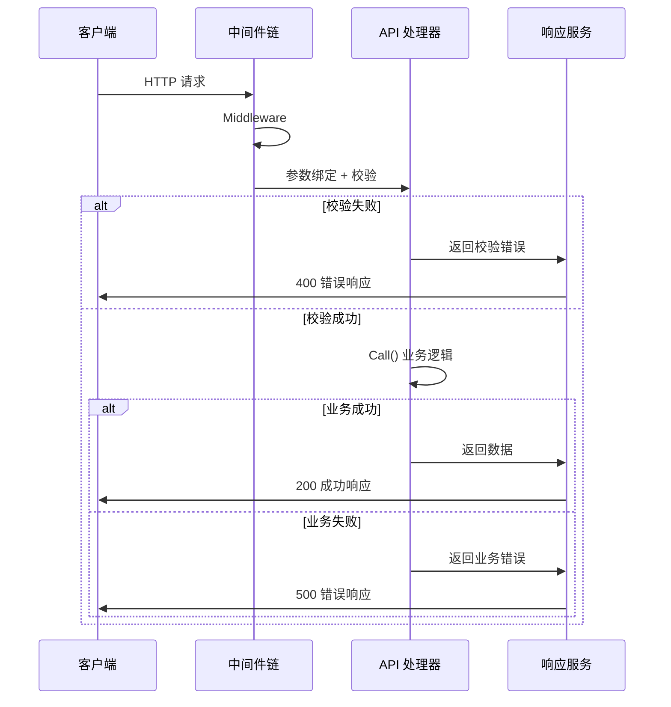

# 路由和中间件注册说明

## 概述

Hecc-Blot 框架基于 Gin 框架实现了路由和中间件的自动化注册机制，并提供参数自动校验和返回值自动包装功能。框架同时支持 API 路由和 SSE（Server-Sent Events）路由。

**请求处理流程**:



***

## 路由注册机制

### 1. API 处理器接口

```go
type IApiHandle interface {
    Get(apiPath string, api interface{})
    Post(apiPath string, api interface{})
    Middleware(middlewares ...IMiddleware) IApiHandle
    Group(relativePath string, middlewares ...IMiddleware) IApiHandle
    Listen()
    Engine() *gin.Engine
}
```

### 2. 创建 API 处理器

```go
// 创建响应服务
responseSvc := api.NewResponseSvc()

// 创建 API 处理器
apiHandle := api.NewApiSvc(&config.Server, responseSvc, container)
```

### 3. 注册路由

```go
func register(apiHandle iCoreApi.IApiHandle) {
    // 注册中间件
    apiHandle.Middleware(&ReplayMiddleware{}, &TokenMiddleware{})
    
    // 注册 POST 接口
    apiHandle.Post("account/add", &AddApi{})
    
    // 注册 GET 接口
    apiHandle.Get("account/list", &ListApi{})
}
```

***

## 中间件注册

### 1. 中间件接口

```go
type IMiddleware interface {
    Middleware() interface{}
}
```

### 2. 定义中间件

```go
// 示例1: 简单中间件
type ReplayMiddleware struct {
    // 可以通过 inject tag 注入依赖
    CacheFactory iCoreCache.ICacheFactory `inject:""`
}

func (r ReplayMiddleware) Middleware() interface{} {
    return func(c *gin.Context) {
        // 前置处理
        r.CacheFactory.Local().Set("key", "value", time.Minute)
        
        c.Next()
        
        // 后置处理
    }
}

// 示例2: Token 验证中间件
type TokenMiddleware struct {
    ResponseSvc iCoreApi.IResponse `inject:""`
}

func (t TokenMiddleware) Middleware() interface{} {
    return func(c *gin.Context) {
        // 从请求头获取 token
        token := c.GetHeader("Authorization")
        if token == "" {
            t.ResponseSvc.Regular(c, nil, errorSvc.NewError(response.TokenInvalid, errors.New("token 为空")))
            c.Abort()
            return
        }
        
        // 验证 token 逻辑...
        c.Set("user_id", 123)
        c.Next()
    }
}
```

### 3. 注册中间件

```go
apiHandle.Middleware(
    &ReplayMiddleware{},
    &TokenMiddleware{},
    &LoggerMiddleware{}
)
```

**执行顺序**: 按照注册顺序依次执行

**分组注册**: 通过 `Group` 让中间件仅作用于指定分组，不同路由组使用不同中间件：

```go
// API 分组挂 Token 鉴权，SSE 路由不受影响
apiGroup := apiHandle.Group("", &TokenMiddleware{})
apiGroup.Post("account/add", &AddApi{})
```

***

## 请求限流中间件

框架提供 `RateLimitMiddleware`，按客户端 IP 限流，超限返回 `429` + 统一响应格式（`code=40006`「请求过于频繁」）。

### 1. 后端与算法

限流器通过 `hecc-blot-core/contract/ratelimit.RateLimiter` 接口抽象，两种后端：

| 后端 | 构造方式 | 适用场景 |
|------|---------|---------|
| 内存 | `api.NewMemoryLimiter(cfg)` | 单实例 |
| Redis | `cache.NewRedisLimiter(cacheFactory.Redis(), cfg)` | 集群（跨实例统一计数，Lua 原子，复用缓存 Redis 实例） |

内存后端支持两种算法（由 `cfg.Algorithm` 决定）：

| 算法 | 值 | 说明 |
|------|-----|------|
| 滑动窗口 | `sliding_window`（默认） | 窗口内计数，边界平滑无突发 |
| 令牌桶 | `token_bucket` | 恒定速率，允许短时突发 |

> Redis 后端当前为滑动窗口实现；Redis 异常时 fail-open（放行），保证限流组件不拖垮业务。

### 2. 使用

```go
import (
    iCoreRatelimit "github.com/hecc-blot/core/contract/ratelimit"
)

// 内存后端（单实例）
limiter := api.NewMemoryLimiter(iCoreRatelimit.Config{
    Algorithm: iCoreRatelimit.SlidingWindow,
    Limit:     100, // 窗口内最大请求数
    Window:    60,  // 窗口时长（秒）
})
apiHandle.Middleware(api.NewRateLimitMiddleware(limiter))

// Redis 后端（集群，复用 cacheFactory 的 Redis 实例）
limiter = cache.NewRedisLimiter(cacheFactory.Redis(), iCoreRatelimit.Config{
    Algorithm: iCoreRatelimit.SlidingWindow,
    Limit:     100,
    Window:    60,
})
apiHandle.Middleware(api.NewRateLimitMiddleware(limiter))
```

### 3. 配置

是否启用限流由组装层是否注册中间件决定（见上一节），配置仅描述启用后的后端/算法/阈值。

```yaml
server:
  rate_limit:
    backend: memory            # memory | redis
    algorithm: sliding_window  # sliding_window | token_bucket
    limit: 100                 # 窗口内最大请求数 / 桶容量
    window: 60                 # 窗口时长（秒）
```

***

## API 定义规范

### 1. API 接口

```go
type IApi interface {
    Call(ctx *gin.Context) (interface{}, coreError.IError)
}
```

### 2. 定义 API

```go
type AddApi struct {
    // 注入字段（必须放在最前面）
    DbFactory iCoreDb.IDbFactory `inject:""`
    LogSvc    iCoreLog.ILog      `inject:""`
    
    // 请求参数（必须放在最后，通过匿名嵌入）
    AddRequest
}

func (a AddApi) Call(ctx *gin.Context) (interface{}, iCoreError.IError) {
    // 使用注入的服务
    a.LogSvc.Info(ctx, "add account")
    
    // 使用请求参数
    newAccount := AccountModel{
        AccountName: a.Name,
    }
    
    // 数据库操作
    err := a.DbFactory.Build(ctx).Add(&newAccount)
    if err != nil {
        return nil, errorSvc.NewError(response.Fail, err)
    }
    
    // 返回数据
    return newAccount, nil
}
```

***

## 参数自动校验

### 1. 请求参数定义

```go
type AddRequest struct {
    Name     string `json:"name" binding:"required"`
    Age      int    `json:"age" binding:"required,min=1,max=150"`
    Email    string `json:"email" binding:"email"`
    Password string `json:"password" binding:"required,min=6"`
}
```

### 2. 自定义错误信息

实现 `IValidator` 接口来自定义错误信息：

```go
func (a AddRequest) GetMessages() entityApi.Messages {
    return entityApi.Messages{
        "Name.required":     "用户名不能为空",
        "Age.required":      "年龄不能为空",
        "Age.min":           "年龄最小为1",
        "Age.max":           "年龄最大为150",
        "Email.email":       "邮箱格式不正确",
        "Password.required": "密码不能为空",
        "Password.min":      "密码长度至少6位",
    }
}
```

### 3. 校验流程

框架在注册路由时为每个请求创建独立 API 实例（避免并发数据竞争），然后进行参数校验：

```go
func (f *ApiHandle) registerAPI(apiPath string, apiInstance interface{}, method string) {
    f.container.Inject(apiInstance)

    if _, ok := apiInstance.(api.IApi); ok {
        // 缓存具体类型
        apiType := reflect.TypeOf(apiInstance).Elem()

        handler := func(c *gin.Context) {
            // 每个请求创建独立实例，避免并发共享写入
            newInstance := reflect.New(apiType).Interface()
            f.container.Inject(newInstance)
            api := newInstance.(iCoreApi.IApi)

            // 自动绑定参数并校验
            if err := c.ShouldBind(newInstance); err != nil {
                f.responseSvc.Regular(c, nil, coreError.New(response.ValidateError, GetErrorMsg(api, err)))
                return
            }

            resp, err := api.Call(c)
            f.responseSvc.Regular(c, resp, err)
        }

        switch method {
        case http.MethodGet:
            f.engine.GET(apiPath, handler)
        case http.MethodPost:
            f.engine.POST(apiPath, handler)
        }
    }
}
```

### 4. 校验器错误处理

框架通过 `util.GetErrorMsg()` 获取校验错误消息，支持三级兜底：自定义消息 → validator 默认 → 原始 error。

详见 [参数校验](validator.md)。

***

## 返回值自动包装

框架自动将 API 返回值包装为 `{code, message, data}` 统一格式。成功时返回 `code: 10000`，失败时根据 `IError.GetCode()` 映射对应响应码。

详见 [统一错误与响应](error_response.md)。

***

## 完整示例

### 1. 主函数入口

```go
func main() {
    // 加载配置
    config, _ := initConf("/config.yaml")
    
    // 创建组件
    logSvc, _ := log.NewLogger(&config.Log)
    traceSvc, traceClearUp, _ := trace.NewTraceSvc(&config.Trace)
    defer traceClearUp()
    dbFactory, clearUp, _ := db.NewDbFactory(&config.Db, logSvc)
    defer clearUp()
    cacheFactory := cache.NewCacheFactory(&config.Cache, traceSvc)
    responseSvc := api.NewResponseSvc()
    
    // 注册到 IOC 容器
    container := ioc.New()
    container.Set(new(iCoreDb.IDbFactory), dbFactory)
    container.Set(new(iCoreLog.ILog), logSvc)
    container.Set(new(iCoreCache.ICacheFactory), cacheFactory)
    container.Set(new(iCoreApi.IResponse), responseSvc)
    container.Set(new(iCoreTrace.ITrace), traceSvc)
    
    // 创建 API 处理器
    apiHandle := api.NewApiSvc(&config.Server, responseSvc, container)
    
    // 注册路由和中间件
    register(apiHandle)
    
    // 启动服务
    apiHandle.Listen()
}
```

### 2. 路由注册

```go
func register(apiHandle iCoreApi.IApiHandle) {
    // 注册全局中间件
    apiHandle.Middleware(
        &ReplayMiddleware{},
        &TokenMiddleware{},
    )
    
    // 注册 API
    {
        apiHandle.Post("account/add", &AddApi{})
        apiHandle.Get("account/list", &ListApi{})
        apiHandle.Post("account/update", &UpdateApi{})
        apiHandle.Post("account/delete", &DeleteApi{})
    }
}
```

***

## SSE 路由注册

SSE（Server-Sent Events）与 API 共享 Gin Engine 和 IMiddleware 接口。详细用法见 [SSE 服务文档](sse.md)。

***

## 配置说明

### 服务配置

```yaml
server:
  port: "9500"
  env: dev                 # dev | test | product
  read_timeout: 30         # 读取超时（秒）
  write_timeout: 30        # 写入超时（秒）
  idle_timeout: 60         # 空闲超时（秒）
  body_size_limit: 10485760  # 请求体大小限制（字节）
```

### 内置中间件

框架在创建 API 处理器时自动注册以下中间件：

| 中间件 | 功能 |
|--------|------|
| `gin.Recovery()` | 捕获 handler panic，返回 500 而非进程崩溃 |
| `bodySizeLimit` | 限制请求体大小，防止大 payload 攻击，默认 10MB |

> 链路追踪中间件不再自动注册，请通过 `trace.NewHttpMiddleware(traceSvc)` 显式注册，详见 [链路追踪](trace.md)。

### 环境模式映射

| 环境      | Gin 模式      | 说明          |
| ------- | ----------- | ----------- |
| dev     | DebugMode   | 开发模式，输出详细日志 |
| test    | TestMode    | 测试模式        |
| product | ReleaseMode | 生产模式，优化性能   |

***

## 工作流程图

```
┌────────────────────────────────────────────────────────────────┐
│                      请求处理流程                              │
├────────────────────────────────────────────────────────────────┤
│                                                               │
│  请求 → [中间件1] → [中间件2] → [API处理] → [响应包装]        │
│                                                               │
│  详细流程:                                                     │
│  1. 请求到达                                                   │
│         ↓                                                     │
│  2. 中间件链执行 (ReplayMiddleware → TokenMiddleware)          │
│         ↓                                                     │
│  3. 参数自动绑定和校验 (ShouldBind)                            │
│         ↓                                                     │
│  4. 调用 API.Call()                                           │
│         ↓                                                     │
│  5. 返回值自动包装 (ResponseSvc.Regular)                       │
│         ↓                                                     │
│  6. 返回统一格式响应                                           │
│                                                               │
└────────────────────────────────────────────────────────────────┘
```

***

## 总结

框架的路由和中间件机制提供了以下特性：

1. **自动注入**: 注册时自动注入依赖服务
2. **参数校验**: 自动绑定并校验请求参数
3. **自定义错误**: 支持自定义校验错误信息，非 validator 错误兜底返回原始消息
4. **统一响应**: 自动包装返回值为统一格式，响应体对象池化减少 GC
5. **并发安全**: 每个请求创建独立 API 实例，避免数据竞争
6. **链式调用**: 支持中间件链式注册
7. **内置保护**: 自动注册 Recovery（防 panic 崩溃）、Body 大小限制、请求超时控制

核心优势：

- **减少样板代码**: 无需手动绑定参数和包装返回值
- **统一规范**: 所有 API 遵循统一的请求和响应格式
- **易于扩展**: 新增 API 只需定义结构体和实现 Call 方法
- **类型安全**: 编译时检查接口实现
- **生产就绪**: 内置超时控制、body 限制、panic 恢复等安全机制

## 相关文档

| 文档 | 说明 |
|------|------|
| [统一错误与响应](error_response.md) | 响应格式与错误码 |
| [参数校验](validator.md) | Binding tag 与自定义错误 |
| [IOC 注入](ioc_injection.md) | 中间件和 API 的依赖注入 |
| [SSE 服务](sse.md) | SSE 路由与实时推送 |
